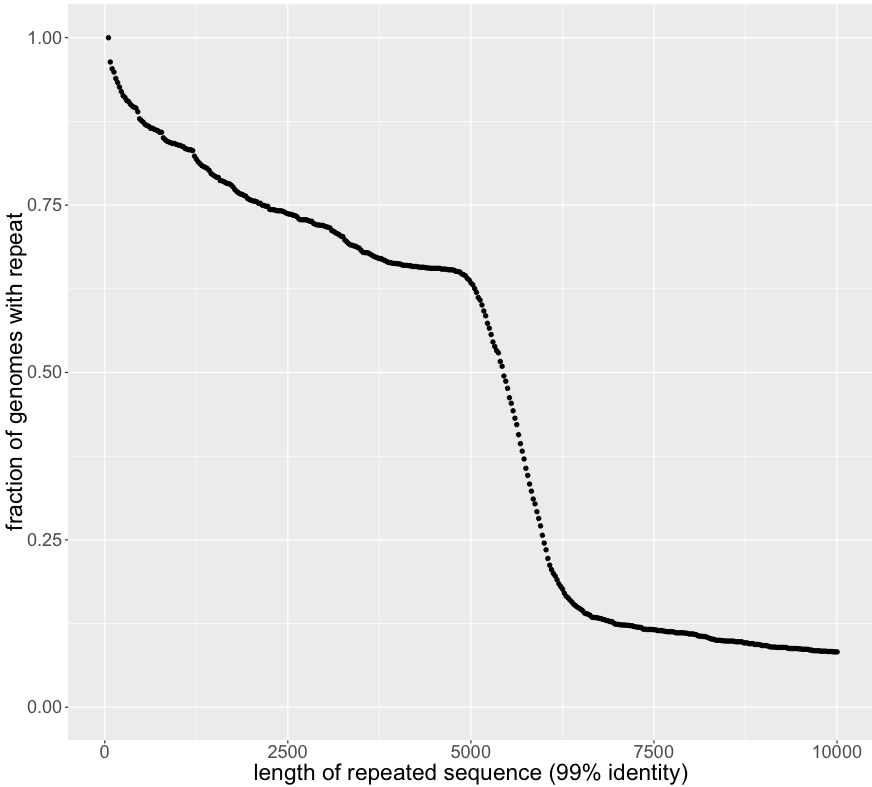

# longest-repeats

finding the longest repeats in bacterial genomes
to answer a question I had about the length distribution of perfect/near-perfect repeats
as it relates to assembling complete genomes

run self_blast.sh first, then longest_repeats.R

the sharp dropoff at 5-7kb is caused by near-identical repeats of the ribosomal operon in many bacterial genomes
https://twitter.com/pathogenomenick/status/827993853298892801

